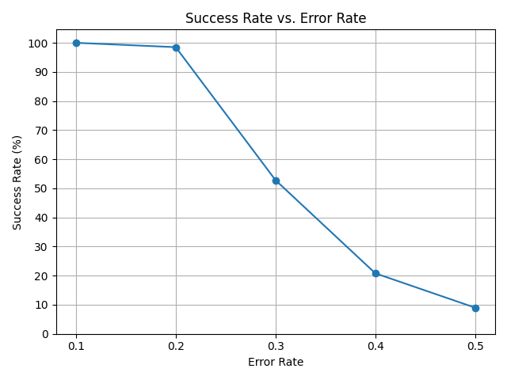

### **Relatório sobre o Funcionamento do Protocolo de Comunicação e seu Comportamento em Relação ao Nível de Erro na Internet**

Aluno: Abraão de Paula Carolino | Matrícula: 202135016

#### **1. Introdução:**

O protocolo de comunicação implementado neste experimento simula a troca de mensagens entre computadores em uma rede. Ele é projetado para lidar com erros de comunicação, como falhas na entrega de mensagens, atrasos e modificações de identificadores de mensagem. O comportamento do protocolo é avaliado em termos de sucesso na entrega das mensagens em diferentes cenários de erro na internet.

#### **2. Funcionamento do Protocolo de Comunicação:**

O protocolo de comunicação consiste em duas entidades principais: os computadores (Sender e Receiver) e a internet, que facilita a troca de mensagens entre eles. Os computadores podem enviar e receber mensagens, enquanto a internet gerencia o roteamento das mensagens e simula condições de rede, como atrasos e erros.

##### **2.1. Sender:**

- A classe Sender representa um computador que envia mensagens para outros computadores na rede.
- O Sender cria mensagens e as envia para os computadores conectados.
- Ele aguarda a confirmação da recepção da mensagem e, se necessário, tenta reenviar a mensagem.

##### **2.2. Receiver:**

- A classe Receiver representa um computador que recebe mensagens de outros computadores na rede.
- Quando uma mensagem é recebida, o Receiver confirma a recepção enviando uma mensagem de confirmação para o remetente.
- Além disso, o Receiver verifica a validade da mensagem recebida antes de confirmar sua recepção. Isso é feito verificando se o ID da mensagem é um valor não negativo e se a mensagem é uma confirmação ou não está expirada.

##### **2.3. Internet:**

- A classe Internet gerencia a troca de mensagens entre os computadores.
- Ela simula condições de rede, como atrasos e erros, durante o envio e recebimento de mensagens.
- A Internet mantém uma lista de endereços IP de todos os computadores na rede e roteia as mensagens para os destinatários corretos.

#### **3. Comportamento em Relação ao Nível de Erro na Internet:**

O protocolo de comunicação é submetido a diferentes níveis de erro na internet para avaliar seu desempenho em condições adversas. As taxas de sucesso em relação às taxas de erro são analisadas em vários cenários.

##### **3.1. Experimento:**

- O experimento é executado com diferentes taxas de erro (E) na internet (10%, 20%, 30%, 40% e 50%).
- A taxa de falha (F) equivale a 1/4 da taxa de erro, logo 2.5%, 5%, 7.5%, 10% e 12.5%
- Cada execução do experimento tem a duração de 2 minutos.

##### **3.2. Resultados:**

- Os resultados mostram uma clara correlação entre a taxa de erro na internet e a taxa de sucesso na entrega das mensagens.
- Com uma taxa de erro de 10%, o protocolo alcança 100% de sucesso na entrega das mensagens.
- À medida que a taxa de erro aumenta, a taxa de sucesso na entrega das mensagens diminui significativamente.
- Com uma taxa de erro de 50%, apenas 9.0% das mensagens são entregues com sucesso.

#### **4. Conclusão:**

O protocolo de comunicação demonstra ser eficaz na entrega de mensagens em condições ideais de rede. No entanto, sua capacidade de lidar com erros de comunicação é limitada, e a taxa de sucesso na entrega das mensagens diminui consideravelmente em redes com altas taxas de erro. Portanto, é importante implementar estratégias robustas de gerenciamento de erros para melhorar o desempenho do protocolo em condições adversas de rede.